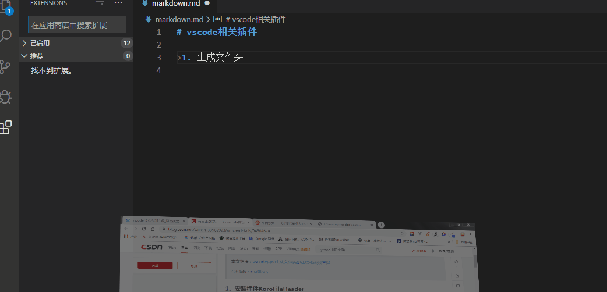
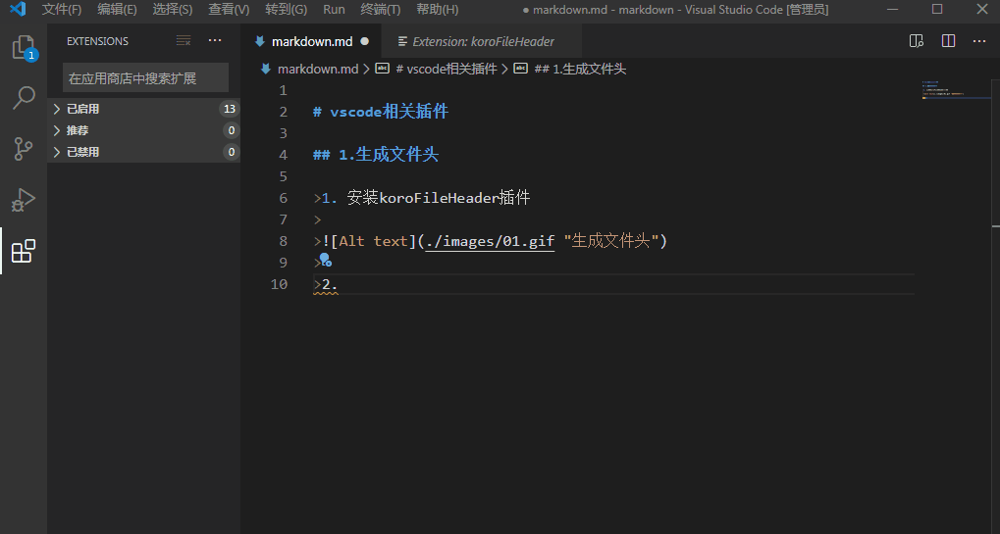
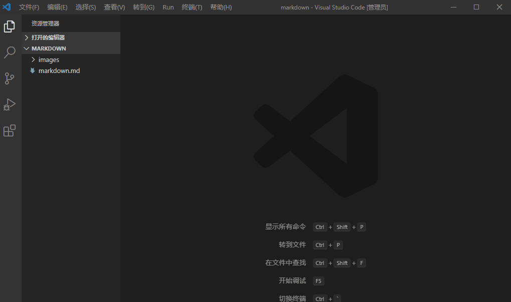

<!--
 * @Autor: jiexingh
 * @Date: 2020-03-24 00:10:24
 * @LastEditors: jiexingh
 * @LastEditTime: 2020-03-25 22:41:15
 -->

# vscode相关插件  

## 1.生成文件头  

>1.安装koroFileHeader插件
>
>
>2.设置自定义头部信息
>
>* 依次选择:文件->首选项->设置->搜索设置->输入koroFileHeader搜索->选择setting.json
>
>* 
>
>* 配置相关参数信息  
>
```javascript
"fileheader.customMade": {    //此为头部注释
        "Description": "",
        "Version": "1.0", //版本号
        "Autor": "jiexingh",  // 作者
        "Date": "Do not edit",  //日期可以不需要编辑
        "LastEditors": "jiexingh", // 最后的编辑者
        "LastEditTime": "Do not edit" //最后编辑时间
    },
    "fileheader.cursorMode": {  //此为函数注释
        "description":"",
        "param": "",
        "return": "",
        "author":"jiexingh"
    }
```
>
>3.新建文件即可生成
>
>* 
>
